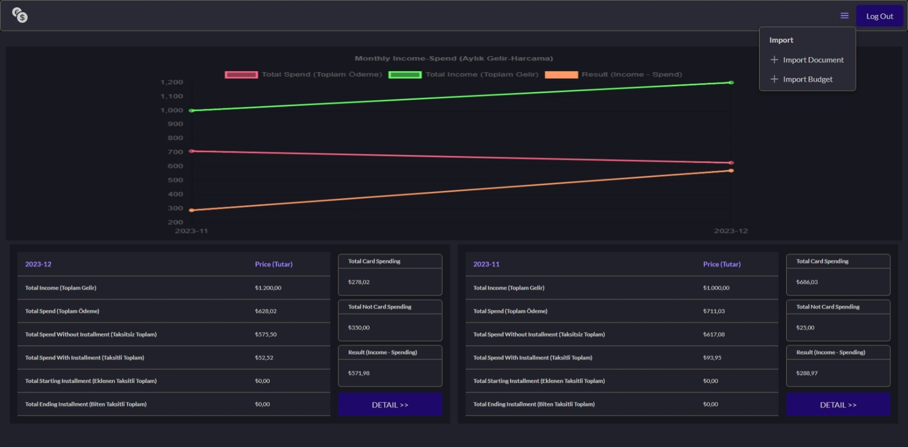

#  budget-buddy-web
An application to track your budget easily

---

## Server

For connecting to database you need to get Firebase private key. To generate a private key file:
1. In firebase console, go to project settings.
2. Go to 'Service accounts' tab.
3. Click the 'Generate new private key' button.

Runs the app in the development mode.\
Backend code will run on http://localhost:8080. You should connect this from client app.

---

## Client

#### `npm start`

Runs the app in the development mode.\
Open [http://localhost:3000](http://localhost:3000) to view it in the browser.

---

### Images

   

   
  

